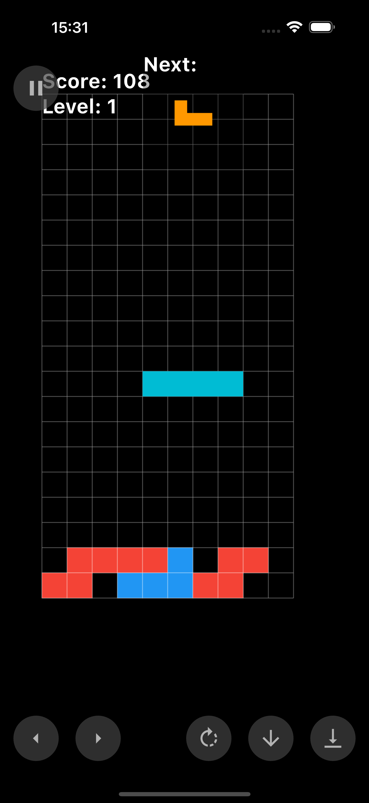

## fietris 🕹️

* flutter very_good_cli ve flame kullanarak yaptığım açık kaynak kodlu bir proje.
* uzun zaman önce oynadığımız tetris oyunundan esinlendim biraz farklı çalışıyor 
* Bazı hatalar mevcut çözüm üretmek gerekli 

**✅ Tamamlanan İşler**
* **🚀 Temel Kurulum ve Altyapı (Flutter/Flame)**
    * `[✅]` **[Core]** Flutter Projesi Oluşturma
    * `[✅]` **[Core]** Flame Entegrasyonu ve Temel `FlameGame` Kurulumu
    * `[✅]` **[Core]** Temel Oyun Döngüsü (`update`/`render`)
    * `[✅]` **[Grid]** Grid Veri Yapısı (`GridData`, `GridCell`, `CellState`)
    * `[✅]` **[Grid]** Görsel Grid Çizimi (`GridBackground`)
* **🧱 Blok Mekanikleri (Flame Components)**
    * `[✅]` **[Gameplay]** Blok Tanımları (`BlockType` enum: şekil, renk)
    * `[✅]` **[Gameplay]** Blok `Component`'i (`Block`, `RectangleComponent` parçaları)
    * `[✅]` **[Gameplay]** Blok Oluşturma (`spawnNewBlock`, rastgele tip)
    * `[✅]` **[Gameplay]** Otomatik Blok Düşme (Zamanlayıcı ile `update`)
    * `[✅]` **[Gameplay]** Çarpışma Algılama (`checkCollision`: sınırlar, dolu hücreler)
    * `[✅]` **[Gameplay]** Blok Yerleşimi (`settleBlock`: `GridData` güncelleme, `Block` kaldırma)
    * `[✅]` **[Gameplay]** Sonraki Blok Göstergesi (Veri: `nextBlockType`)
* **👆 Oyuncu Etkileşimi (Input)**
    * `[✅]` **[Input]** Blok Kontrolü (Hareket - Klavye: Sağ/Sol Ok)
    * `[✅]` **[Input]** Blok Kontrolü (Döndürme - Klavye: Yukarı Ok, basit wall-kick)
    * `[✅]` **[Input]** Blok Kontrolü (Hızlı Düşürme - Klavye: Soft Drop - Aşağı Ok)
    * `[✅]` **[Input]** Blok Kontrolü (Dokunmatik: Kaydırma - Sağ/Sol/Aşağı, Çift Dokunma - Döndürme)
* **⭐ Özel Mekanik ve Satır Temizleme**
    * `[✅]` **[Gameplay]** "Mükemmel Uyum" (Fit) Bonusu (`checkForFitBonus` mantığı `settleBlock` içinde)
    * `[✅]` **[Gameplay]** Tamamlanan Sıraları Algılama ve Temizleme (Klasik Tetris Satır Temizleme)
* **💯 Skorlama ve Oyun Durumu**
    * `[✅]` **[Scoring]** Temel Puanlama (Satır Temizleme)
    * `[✅]` **[Scoring]** Temel Puanlama (Soft Drop bonusu)
    * `[✅]` **[Game Logic]** Oyun Sonu (Tepeye Ulaşma - Spawn kontrolü)
    * `[✅]` **[Game Logic]** Oyun Durumu Yönetimi (`GameState` enum)
    * `[✅]` **[Game Logic]** Oyunu Yeniden Başlatma (Klavye 'R' tuşu)
    * `[✅]` **[Game Logic]** Seviye Sistemi (Satır temizlemeye göre seviye artışı, hızlanma)
* **✨ UI, Görsel ve Ses Efektleri**
    * `[✅]` **[UI]** Skor Gösterimi (`TextComponent`)
    * `[✅]` **[UI]** Seviye Göstergesi (`TextComponent`)
    * `[✅]` **[UI]** Sonraki Blok Göstergesi (Görsel: `NextBlockPreview` component'i)
    * `[✅]` **[UI]** Game Over Ekranı (Basit `TextComponent`)
    * `[✅]` **[VFX]** Yerleşmiş Blok Görseli (`SettledBlocksDisplay`)
    * `[✅]` **[VFX]** Satır Temizleme Efekti (Basit `ParticleSystemComponent`) *(Match-3 efekti kaldırıldı)*
    * `[✅]` **[SFX]** Temel Oyun Ses Efektleri (Hareket, dönme, yerleşme, satır temizleme, oyun sonu - `flame_audio`) *(Match-3 sesi kaldırıldı)*

---

**📝 Yapılması Gereken İşler (Yeni Mekanizma ile Güncellenmiş)**

* **🆕 Otomatik Alan Temizleme Mekanizması**
    * `[ ]` **[Gameplay]** Otomatik 3-Satır Alan Kontrolü: Blok yerleştikten sonra (`settleBlock` içinde), 3x10'luk (veya `gameWidth`) alanları tara. Her 3 satırlık grup için içindeki boş hücre sayısını kontrol et (1-5 aralığında mı?).
    * `[ ]` **[Gameplay]** Otomatik Alan Temizleme: Yukarıdaki koşul sağlandığında, ilgili 3x10'luk alandaki *dolu* hücreleri `GridData`'dan temizle (`CellState.empty`, `color=null` yap).
    * `[ ]` **[Gameplay]** Otomatik Temizleme Sonrası Yerçekimi: Alan temizlendikten sonra, temizlenen bölgenin *üzerindeki* (en üst temizlenen satırın üzeri) blokları `GridData`'da uygun şekilde aşağı kaydır. (Bu, standart satır temizleme yerçekiminden farklı olabilir).
    * `[ ]` **[Scoring]** Otomatik Alan Temizleme Skorlaması: Bu özel 3x10 temizleme mekanizması için ayrı bir puanlama sistemi tanımla ve uygula.
    * `[ ]` **[VFX]** Otomatik Alan Temizleme Efekti: 3x10'luk alandaki bloklar temizlenirken görsel bir efekt göster.
* **⚡ Güçlendirmeler (Power-ups)**
    * `[ ]` **[Feature]** Enerji Barı (UI ve dolum mantığı - örn: temizlenen blok sayısı, özel temizlemeler ile).
    * `[ ]` **[Feature]** Güçlendirme Aktivasyonu (Enerji barı dolunca veya rastgele).
    * `[ ]` **[Feature]** Güçlendirme Efektleri Kodlama (Bomba, Renk Silici, Zaman Dondurucu vb.).
* **🎮 Oyun Modları ve Mantığı**
    * `[ ]` **[Game Logic]** Zaman Sayacı ve Süreye Dayalı Oyun Modu.
    * `[ ]` **[Game Logic]** Hedef Skoruna Dayalı Kazanma Koşulu.
    * `[ ]` **[Game Logic]** Duraklatma (Pause) ve Devam Etme (Resume) Mekanizması.
* **👆 Alternatif Girdiler**
    * `[✅]` **[Input]** Hard Drop (Anında İndirme) mekaniği (Klavye -örn: Boşluk, Dokunmatik - örn: Hızlı Swipe).
    * `[ ]` **[Optimization/Refactor]** Performans İyileştirmeleri ve Kod Kalitesi.
    * `[ ]` **[Balance]** Oyun Dengesi Ayarları.

